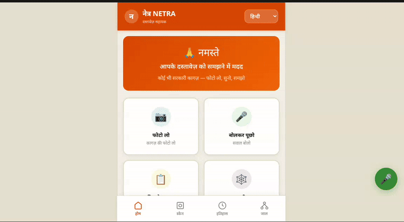
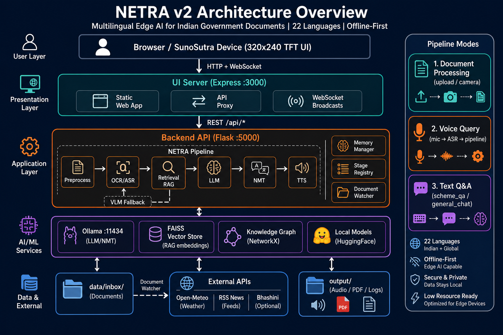

<p align="center">
  <strong>NETRA v2 — Suno Sutra</strong><br>
  <em>Open-Source Edge AI Pipeline for Indian Document Processing</em>
</p>

<p align="center">
  
  
  
  
  
  
  
  
</p>

<p align="center">
  <strong>Team Falkome AI</strong> — <a href="https://bhashini.gov.in/sahyogi/hackathon/open-handheld-ai/shortlisted">🏆 VYOMA Round 1 Shortlisted</a>
</p>

<p align="center">
  <a href="https://bhashini.gov.in/sahyogi/hackathon/open-handheld-ai">VYOMA Challenge</a> |
  <a href="https://bhashini.gov.in/sahyogi/hackathon/open-handheld-ai/shortlisted">Round 1 Results</a> |
  <a href="https://bhashini.gov.in">Bhashini API</a> |
  <a href="https://ollama.com">Ollama</a> |
  <a href="https://huggingface.co">HuggingFace</a>
</p>

<p align="center">
  
</p>

---

NETRA (Network for Edge-device Translation and Recognition for Accessibility) is a modular, multilingual AI pipeline built for rural India. It processes government documents, scheme letters, legal notices, and agricultural advisories through OCR, LLM summarization, translation, and text-to-speech — all running on edge hardware ([NVIDIA Jetson Orin Nano 8GB](https://www.nvidia.com/en-us/autonomous-machines/embedded-systems/jetson-orin/nano-super-developer-kit/)) or standard CPU servers.

**22 Indian languages** supported. Runs fully offline. Built for the [**VYOMA Innovation Challenge**](https://bhashini.gov.in/sahyogi/hackathon/open-handheld-ai) by [Digital India BHASHINI (MeitY)](https://bhashini.gov.in), [Current AI](https://currentai.in), and [Kalpa Impact](https://kalpaimpact.com).

> **Team Falkome AI** — [Shortlisted in VYOMA Round 1](https://bhashini.gov.in/sahyogi/hackathon/open-handheld-ai/shortlisted)

---

## Key Features

- **Document Understanding** — Scan any government document (image, PDF, text) and get a plain-language explanation
- **Multilingual Output** — Translate summaries into 22 Indian languages + English
- **Voice I/O** — Speak a question, hear the answer in your language
- **RAG-Powered Scheme Q&A** — Ask about PM Kisan, Ayushman Bharat, or any scheme with knowledge-base grounded answers
- **Knowledge Graph** — Auto-extract entities (PAN, amounts, dates, pincodes) and build a queryable document graph
- **Edge-First** — Runs on Jetson Orin Nano 8GB with VRAM budgeting and model hot-swap
- **⚡ Optimized for Speed** — Full pipeline in **~5 seconds** on Jetson Orin Nano (embedding → RAG → LLM → TTS)
- **40+ Model Variants** — Choose from [Ollama](https://ollama.com), [HuggingFace](https://huggingface.co), [oLLM](https://github.com/Mega4alik/ollm), [BitNet](https://github.com/microsoft/BitNet), and [Bhashini](https://bhashini.gov.in) providers
- **Performance & Accuracy Benchmarking** — Built-in scripts for latency, hardware utilization, and answer quality

---

## Table of Contents

- [Architecture](#architecture)
- [Performance Optimizations (Jetson Orin Nano)](#performance-optimizations-jetson-orin-nano)
- [Quick Start](#quick-start)
- [How to Run (Step by Step)](#how-to-run-step-by-step)
- [Model Weights & Download Links](#model-weights--download-links)
  - [Active Pipeline — Quantized Models (INT4 / INT8)](#active-pipeline--quantized-models-int4--int8)
  - [All Available Models (Full Catalog)](#all-available-models-full-catalog)
- [Project Structure](#project-structure)
- [Pipeline Stages](#pipeline-stages)
- [Model Catalog](#model-catalog)
- [Core Framework](#core-framework)
- [API Reference](#api-reference)
- [Benchmarking](#benchmarking)
- [Configuration](#configuration)
- [Hardware Specifications](#hardware-specifications)
- [Environment Variables](#environment-variables)
- [Tech Stack](#tech-stack)
- [Troubleshooting](#troubleshooting)
- [References & Links](#references--links)
- [NETRA v3 — Native C++ for Jetson](#netra-v3--native-c-for-jetson)

---

## Architecture

<p align="center">
  
</p>

**Processing Flow:**

1. **Input** arrives as a document image, PDF, audio recording, or plain text
2. **Preprocessing** cleans and deskews document images ([OpenCV](https://opencv.org/))
3. **OCR** extracts text from images ([PaddleOCR](https://github.com/PaddlePaddle/PaddleOCR) / [EasyOCR](https://github.com/JaidedAI/EasyOCR) / [Surya](https://github.com/VikParuchuri/surya) / [GOT-OCR](https://huggingface.co/stepfun-ai/GOT-OCR2_0))
4. **ASR** transcribes audio to text ([faster-whisper](https://github.com/SYSTRAN/faster-whisper) / [IndicConformer](https://github.com/AI4Bharat/IndicConformerASR))
5. **Retrieval** searches the [FAISS](https://github.com/facebookresearch/faiss) vector store for relevant scheme context (RAG) — top_k=1 for speed
6. **LLM** generates a simplified explanation **directly in the user's language** using the document + RAG context ([Qwen2.5-1.5B](https://huggingface.co/Qwen/Qwen2.5-1.5B-Instruct) on Jetson, [Qwen3:4B](https://huggingface.co/Qwen/Qwen3-4B) on GPU)
7. **NMT** *(skipped on edge)* — the LLM is prompted to answer in the target language directly, eliminating a separate translation call
8. **TTS** converts the text to speech audio ([Piper](https://github.com/rhasspy/piper) on Jetson / [IndicF5](https://huggingface.co/ai4bharat/IndicF5) / [Edge TTS](https://github.com/rany2/edge-tts))
9. **Knowledge Graph** (optional) extracts entities and builds a persistent graph ([NetworkX](https://networkx.org/))

---

## Performance Optimizations (Jetson Orin Nano)

NETRA v2 is optimized to run the **full pipeline in ~5-6 seconds** on Jetson Orin Nano 8GB, meeting the VYOMA Competition requirement of **< 6 second** end-to-end latency while maintaining good answer accuracy.

### Pipeline Timing Breakdown (Jetson Orin Nano, warm model)

| Stage | Model | Time |
|---|---|---|
| Embedding + FAISS Retrieval | Qwen3-Embedding-0.6B (Q8_0) | ~0.5s |
| **LLM Inference** | **Qwen2.5-3B (Q4_K_M)** | **~3-4s** |
| NMT (Translation) | Skipped — LLM responds in target language directly | 0s |
| TTS (Text-to-Speech) | Piper (INT8 ONNX) | ~0.5-1s |
| Flask + overhead | — | ~0.2s |
| **Total** | | **~5-6s** |

### Key Optimizations Applied

| # | Optimization | Impact |
|---|---|---|
| 1 | **Balanced LLM: Qwen2.5-3B** — good accuracy + fast inference | ~2x faster than Qwen3-4B, reliable Hindi output |
| 2 | **256 tokens max** (3-5 sentences) | 256 tokens at ~50 tok/s = ~5s |
| 3 | **NMT eliminated** — LLM answers in the user's language directly | Saves an entire LLM call (~3-4s) |
| 4 | **Focused RAG context** — top_k=2, max 1000 chars | Enough context for accuracy, fast prompt eval |
| 5 | **No query translation** — embedding model handles multilingual natively | Saves another LLM call (~3-4s) |
| 6 | **Accuracy-focused prompts** — strict factual rules + language enforcement | Prevents hallucination, ensures correct language |
| 7 | **Model pre-warming** — all models loaded into GPU at startup (`keep_alive=30m`) | Zero cold-start penalty |
| 8 | **`/no_think` mode** — disables Qwen3's internal reasoning when used | No wasted thinking tokens |

### Jetson-Specific Config

```yaml
# Backend/config/jetson.yaml
defaults:
  llm: "ollama_qwen2_5_3b"      # Balanced 3B model (accuracy + speed)

inference:
  max_output_length: 256          # 3-5 sentence answers
  timeout_seconds: 10             # Fail fast
```

> **Note:** On first request after server start, models are loaded into GPU memory (~8-10s). All subsequent requests run at full speed (~5-6s). The server pre-warms models automatically on startup.

---

## Quick Start

```bash
# 1. Clone
git clone https://github.com/Gaurav14cs17/NETRA-v2.git
cd NETRA-v2

# 2. Backend
cd Backend
pip install -r requirements.txt
python server.py                    # starts on port 5000

# 3. UI (in another terminal)
cd UI
npm install
node server.js                      # starts on port 3000

# 4. Open browser → http://localhost:3000
```

---

## How to Run (Step by Step)

### Prerequisites

| Requirement | Version | Install Link | Notes |
|---|---|---|---|
| Python | 3.10+ | [python.org](https://www.python.org/downloads/) | Core runtime |
| pip | latest | Comes with Python | Package manager |
| Node.js | 18+ | [nodejs.org](https://nodejs.org/) | UI server |
| npm | latest | Comes with Node.js | Package manager |
| NVIDIA GPU + CUDA | 11.8+ | [CUDA Toolkit](https://developer.nvidia.com/cuda-downloads) | Optional — CPU mode works too |
| Ollama | latest | [ollama.com/download](https://ollama.com/download) | Optional — for Ollama-based models |
| ffmpeg | latest | [ffmpeg.org](https://ffmpeg.org/download.html) | Required for audio processing (ASR) |
| espeak-ng | latest | `sudo apt install espeak-ng` | Required for eSpeak TTS |

### Step 1: Clone the Repository

```bash
git clone https://github.com/Gaurav14cs17/NETRA-v2.git
cd NETRA-v2
```

### Step 2: Set Up the Backend

```bash
cd Backend

# Option A: Install from requirements.txt
pip install -r requirements.txt

# Option B: Install as editable package with extras
pip install -e ".[all]"             # everything
pip install -e ".[rag,graph]"       # only RAG + Knowledge Graph
pip install -e ".[ocr,asr,tts]"     # only OCR + ASR + TTS
pip install -e ".[quantization]"    # AWQ + GPTQ quantization support
pip install -e ".[dev]"             # pytest + ruff for development

# Copy environment template
cp .env.example .env
# Edit .env if you have Bhashini API credentials
```

### Step 3: Set Up Ollama (if using Ollama models)

```bash
# Install Ollama (Linux)
curl -fsSL https://ollama.com/install.sh | sh

# Start the Ollama server
ollama serve

# Pull the required models (in another terminal)
ollama pull qwen2.5:3b               # Default LLM — balanced speed + accuracy (recommended)
ollama pull qwen3:4b                # Full LLM (higher quality, slower)
ollama pull qwen3-embedding:0.6b    # Embedding model for RAG
ollama pull openbmb/minicpm-v4.6    # VLM for OCR fallback

# Optional alternative models
ollama pull qwen2.5:3b              # Alternative LLM
ollama pull llama3.2:3b             # Alternative LLM
ollama pull gemma2:2b               # Alternative LLM
```

### Step 4: Start the Backend Server

```bash
cd Backend
PYTHONPATH=src python server.py
# Server starts on http://localhost:5000
# On first startup: auto-ingests all policy PDFs from polyic/state/ into FAISS
# Subsequent startups: skips ingestion (index already exists)
```

> **Auto-Ingest on First Run:** When the server starts and no FAISS index exists (fresh machine), it automatically runs `ingest_policies.py` to build the RAG knowledge base from all policy documents in `polyic/state/`. This takes ~2-5 minutes on first startup depending on the number of documents.

**For CPU-only mode:**
```bash
NETRA_DEVICE_TARGET=cpu PYTHONPATH=src python server.py
```

**For Jetson Orin Nano:**
```bash
NETRA_DEVICE_TARGET=jetson_orin_nano PYTHONPATH=src python server.py
```

### Step 5: Set Up and Start the UI

```bash
cd UI
npm install
node server.js
# UI starts on http://localhost:3000
```

### Step 6: Seed the Knowledge Base (auto or manual)

The RAG knowledge base is **automatically built on first server startup** from all PDFs/TXT files in `polyic/state/`. To manually re-ingest or reset:

```bash
cd Backend

# Re-ingest (skips already-indexed files)
PYTHONPATH=src python scripts/ingest_policies.py

# Full reset + re-ingest from scratch
PYTHONPATH=src python scripts/ingest_policies.py --reset

# Preview without writing (dry run)
PYTHONPATH=src python scripts/ingest_policies.py --dry-run

# Pre-populate with government scheme data
PYTHONPATH=src python scripts/seed_knowledge_base.py
```

> The ingestion script handles text PDFs (via pdfplumber), scanned/image PDFs (via PaddleOCR), HTML files saved as `.pdf`, and plain `.txt` files.

### Step 7: Use NETRA

**Via Browser:** Open [http://localhost:3000](http://localhost:3000)

**Via API (curl):**

```bash
# Check health
curl http://localhost:5000/api/health

# Ingest a document into knowledge base
curl -X POST http://localhost:5000/api/ingest \
  -H "Content-Type: application/json" \
  -d '{"text": "PM Kisan Samman Nidhi provides Rs 6000 per year to small and marginal farmers in three installments."}'

# Ask a question (auto-routes to scheme_qa or general_chat)
curl -X POST http://localhost:5000/api/pipeline/text \
  -H "Content-Type: application/json" \
  -d '{"text": "PM Kisan scheme ka kya fayda hai?", "language": "hi"}'

# Process a document image
curl -X POST http://localhost:5000/api/pipeline/run \
  -F "image=@document.jpg" \
  -F "language=hi"

# Process a PDF
curl -X POST http://localhost:5000/api/pipeline/run \
  -F "file=@notice.pdf" \
  -F "language=hi"

# Transcribe audio (ASR only)
curl -X POST http://localhost:5000/api/transcribe \
  -F "audio=@recording.wav" \
  -F "lang=hi"

# Process voice input (ASR → LLM → NMT → TTS)
curl -X POST http://localhost:5000/api/pipeline/run \
  -F "audio=@question.wav" \
  -F "language=hi" \
  -F "mode=voice"

# Bulk ingest multiple files
curl -X POST http://localhost:5000/api/ingest/bulk \
  -F "files=@doc1.pdf" \
  -F "files=@doc2.pdf" \
  -F "files=@image1.jpg"

# PIN code → state + schemes lookup
curl -X POST http://localhost:5000/api/location/lookup \
  -H "Content-Type: application/json" \
  -d '{"pincode": "226001"}'

# Get hardware metrics
curl http://localhost:5000/api/benchmark/hardware

# Download summary PDF
curl http://localhost:5000/api/output/pdf --output summary.pdf
```

**Via CLI:**

```bash
cd Backend

# Process a document image
PYTHONPATH=src python -m netra process document.jpg --lang hi --task simplify

# Translate text
PYTHONPATH=src python -m netra translate "Hello, how are you?" --src en --tgt hi

# Show system info
PYTHONPATH=src python -m netra info
```

### Step 8: Run Benchmarks

```bash
cd Backend

# Performance benchmark (latency, CPU/GPU utilization)
PYTHONPATH=src python scripts/benchmark_performance.py --mode direct --runs 3 --model-perf

# Accuracy benchmark (answer quality)
PYTHONPATH=src python scripts/benchmark_accuracy.py --mode direct

# Multi-model comparison
PYTHONPATH=src python scripts/benchmark_accuracy.py --mode direct --compare

# API-mode benchmarks (requires server running)
python scripts/benchmark_performance.py --mode api --runs 5
```

---

## Model Weights & Download Links

### Active Pipeline — Quantized Models (INT4 / INT8)

These are the **exact models running in the default NETRA v2 pipeline**, all quantized for edge deployment on 8 GB VRAM. Total download: **~4 GB**.

| # | Stage | Model | Quantization | Format | Size | Download |
|---|---|---|---|---|---|---|
| 1 | **OCR** | PaddleOCR v4 | **INT4** | PaddleLite | 150 MB | Auto-downloaded on first run |
| 2 | **Embedding** | Qwen3-Embedding-0.6B | **Q8_0 (INT8)** | GGUF / Ollama | 815 MB | `ollama pull qwen3-embedding:0.6b` |
| 3 | **Retrieval** | Qwen3-Embedding-0.6B | **Q8_0 (INT8)** | GGUF / Ollama | *(reuses #2)* | — |
| 4 | **LLM (Jetson)** | **Qwen2.5-3B** | **Q4_K_M (INT4)** | GGUF / Ollama | **1.8 GB** | `ollama pull qwen2.5:3b` |
| 5 | **LLM (Full)** | Qwen3:4B | **Q4_K_M (INT4)** | GGUF / Ollama | 2.6 GB | `ollama pull qwen3:4b` |
| 6 | **NMT** | — | — | — | — | **Skipped** — LLM answers in target language directly |
| 7 | **TTS** | Piper (Hindi) | **INT8** | ONNX Runtime | 100 MB | Auto-downloaded on first run |
| 8 | **VLM** | MiniCPM-V 4.6 (1.3B) | **Q4_0 (INT4)** | GGUF / Ollama | 1.1 GB | `ollama pull openbmb/minicpm-v4.6` |
| 9 | **ASR** | Whisper Small | **INT8** | CTranslate2 | 150 MB | Auto-downloaded on first run |
| 10 | **Preprocessing** | OpenCV | N/A (no ML) | — | 0 MB | Installed via `pip` |

#### One-Command Setup (Download All Active Models)

```bash
# Step 1: Install Ollama (if not already installed)
curl -fsSL https://ollama.com/install.sh | sh

# Step 2: Pull all Ollama models (INT4 + INT8 quantized)
ollama pull qwen2.5:3b               # Default LLM (balanced speed + accuracy, 1.8 GB)
ollama pull qwen3:4b                # Full LLM (higher quality, slower, 2.6 GB)
ollama pull qwen3-embedding:0.6b    # Embedding + RAG      (Q8_0, 815 MB)
ollama pull openbmb/minicpm-v4.6    # VLM (OCR fallback)   (Q4_0, 1.1 GB)

# Step 3: Start the backend (auto-ingests policy PDFs + auto-downloads PaddleOCR, Piper, Whisper)
cd Backend
pip install -e ".[all]"
PYTHONPATH=src python server.py
```

> **No manual setup needed on a new machine.** Ollama models are pulled with one command each. On first startup, the server auto-ingests all policy PDFs from `polyic/state/` into the FAISS RAG index. PaddleOCR, Piper TTS, and Whisper auto-download their INT4/INT8 weights on first use. Models are pre-warmed into GPU memory on startup for zero cold-start latency.

---

### All Available Models (Full Catalog)

All models below are auto-downloaded on first use. If you need to pre-download weights, use the links below.

### LLM Models

| Model | HuggingFace Link | Size | Quantization | License |
|---|---|---|---|---|
| Qwen2.5-3B-Instruct (AWQ) | [Qwen/Qwen2.5-3B-Instruct-AWQ](https://huggingface.co/Qwen/Qwen2.5-3B-Instruct-AWQ) | ~2 GB | AWQ INT4 | Apache-2.0 |
| Qwen2.5-0.5B-Instruct | [Qwen/Qwen2.5-0.5B-Instruct](https://huggingface.co/Qwen/Qwen2.5-0.5B-Instruct) | ~1 GB | FP32 | Apache-2.0 |
| Gemma-2-2B-IT (GPTQ) | [TechxGenus/gemma-2-2b-it-GPTQ-Int4](https://huggingface.co/TechxGenus/gemma-2-2b-it-GPTQ-Int4) | ~1.5 GB | GPTQ INT4 | Gemma |
| Phi-3.5-Mini-Instruct | [microsoft/Phi-3.5-mini-instruct](https://huggingface.co/microsoft/Phi-3.5-mini-instruct) | ~7.6 GB | FP16 | MIT |
| Llama-3.2-3B-Instruct | [meta-llama/Llama-3.2-3B-Instruct](https://huggingface.co/meta-llama/Llama-3.2-3B-Instruct) | ~6.4 GB | FP16 | Llama-3.2 |
| SmolLM2-1.7B-Instruct | [HuggingFaceTB/SmolLM2-1.7B-Instruct](https://huggingface.co/HuggingFaceTB/SmolLM2-1.7B-Instruct) | ~3.4 GB | AWQ | Apache-2.0 |
| BitNet-b1.58-2B-4T | [microsoft/bitnet-b1.58-2B-4T](https://huggingface.co/microsoft/bitnet-b1.58-2B-4T) | ~0.5 GB | Ternary (1.58b) | MIT |
| BitNet-b1.58-2B-4T (GGUF) | [microsoft/BitNet-b1.58-2B-4T-gguf](https://huggingface.co/microsoft/BitNet-b1.58-2B-4T-gguf) | ~0.4 GB | Ternary (GGUF) | MIT |

### OCR Models

| Model | HuggingFace Link | Size | License |
|---|---|---|---|
| GOT-OCR 2.0 | [stepfun-ai/GOT-OCR2_0](https://huggingface.co/stepfun-ai/GOT-OCR2_0) | ~1.5 GB | Apache-2.0 |
| PaddleOCR v4 | [PaddlePaddle/PaddleOCR](https://github.com/PaddlePaddle/PaddleOCR) (auto-download) | ~150 MB | Apache-2.0 |
| EasyOCR | [JaidedAI/EasyOCR](https://github.com/JaidedAI/EasyOCR) (auto-download) | ~200 MB | Apache-2.0 |
| Surya OCR | [VikParuchuri/surya](https://github.com/VikParuchuri/surya) (auto-download) | ~400 MB | GPL-3.0 |

### ASR Models

| Model | HuggingFace Link | Size | License |
|---|---|---|---|
| Whisper Small (CTranslate2) | [Systran/faster-whisper-small](https://huggingface.co/Systran/faster-whisper-small) | ~500 MB | MIT |
| Distil-Whisper Small (EN) | [distil-whisper/distil-small.en](https://huggingface.co/distil-whisper/distil-small.en) | ~350 MB | MIT |
| IndicConformer (NeMo) | [ai4bharat/indicconformer_stt_hi_hybrid_ctc_rnnt_large](https://huggingface.co/ai4bharat/indicconformer_stt_hi_hybrid_ctc_rnnt_large) | ~450 MB | CC-BY-4.0 |

### NMT Models

| Model | HuggingFace Link | Size | License |
|---|---|---|---|
| NLLB-200-Distilled-600M | [facebook/nllb-200-distilled-600M](https://huggingface.co/facebook/nllb-200-distilled-600M) | ~1.2 GB | CC-BY-NC-4.0 |
| IndicTrans2-1.1B | [ai4bharat/indictrans2-en-indic-1B](https://huggingface.co/ai4bharat/indictrans2-en-indic-1B) | ~2.2 GB | MIT |
| IndicTrans2-200M (Distilled) | [ai4bharat/indictrans2-en-indic-dist-200M](https://huggingface.co/ai4bharat/indictrans2-en-indic-dist-200M) | ~0.4 GB | MIT |

### TTS Models

| Model | HuggingFace Link | Size | License |
|---|---|---|---|
| IndicF5 | [ai4bharat/IndicF5](https://huggingface.co/ai4bharat/IndicF5) | ~1.8 GB | CC-BY-4.0 |
| IndicTTS (Coqui) | [ai4bharat/indic-tts-coqui](https://huggingface.co/ai4bharat/indic-tts-coqui) | ~200 MB | MIT |
| Piper TTS (Hindi) | [rhasspy/piper](https://github.com/rhasspy/piper/releases) | ~100 MB | MIT |

### Embedding Models

| Model | HuggingFace Link | Size | License |
|---|---|---|---|
| Multilingual-E5-Large | [intfloat/multilingual-e5-large](https://huggingface.co/intfloat/multilingual-e5-large) | ~1.1 GB | MIT |
| BGE-Small-EN-v1.5 | [BAAI/bge-small-en-v1.5](https://huggingface.co/BAAI/bge-small-en-v1.5) | ~130 MB | MIT |

### VLM Models (OCR Fallback)

| Model | HuggingFace Link | Size | License |
|---|---|---|---|
| Florence-2-Base | [microsoft/Florence-2-base](https://huggingface.co/microsoft/Florence-2-base) | ~0.5 GB | MIT |
| Moondream2 | [vikhyatk/moondream2](https://huggingface.co/vikhyatk/moondream2) | ~3.6 GB | Apache-2.0 |

### Ollama Models (pulled via `ollama pull`)

| Model | Ollama Command | Size | Use |
|---|---|---|---|
| **Qwen2.5-3B** | `ollama pull qwen2.5:3b` | ~1.8 GB | **Default LLM (balanced accuracy + speed)** |
| **Qwen3:4B** | `ollama pull qwen3:4b` | ~2.6 GB | **Full LLM (higher quality, server/GPU)** |
| Qwen2.5-1.5B | `ollama pull qwen2.5:1.5b` | ~1.0 GB | Fastest LLM (lower accuracy) |
| **Qwen3-Embedding-0.6B** | `ollama pull qwen3-embedding:0.6b` | ~815 MB | **Default Embedding + Retrieval** |
| **MiniCPM-V 4.6** | `ollama pull openbmb/minicpm-v4.6` | ~1.1 GB | **Default VLM (OCR fallback)** |
| Qwen2.5-3B | `ollama pull qwen2.5:3b` | ~2 GB | Alternative LLM (legacy) |
| Qwen2.5-7B | `ollama pull qwen2.5:7b` | ~4.4 GB | Larger LLM |
| Llama-3.2-3B | `ollama pull llama3.2:3b` | ~2 GB | Alternative LLM |
| Gemma-2-2B | `ollama pull gemma2:2b` | ~1.6 GB | Alternative LLM |
| Phi-3.5-Mini | `ollama pull phi3.5` | ~2.2 GB | Alternative LLM |
| Mistral-7B | `ollama pull mistral` | ~4.1 GB | Alternative LLM |
| nomic-embed-text | `ollama pull nomic-embed-text` | ~274 MB | Alternative Embedding (legacy) |
| LLaVA-7B | `ollama pull llava:7b` | ~4.7 GB | Alternative VLM (legacy) |

### Pre-download All HuggingFace Models

```bash
cd Backend

# Download specific models manually
python -c "
from huggingface_hub import snapshot_download
snapshot_download('Qwen/Qwen2.5-3B-Instruct-AWQ', local_dir='models/qwen2.5-3b-awq')
snapshot_download('facebook/nllb-200-distilled-600M', local_dir='models/nllb-600m')
snapshot_download('intfloat/multilingual-e5-large', local_dir='models/e5-large')
snapshot_download('Systran/faster-whisper-small', local_dir='models/whisper-small')
"
```

---

## Project Structure

```
NETRA-v2/
├── assets/
│   ├── netra-v2-architecture-overview.png
│   └── demo.gif                       # Project demo GIF
│
├── polyic/
│   └── state/                         # Government policy documents (by state)
│       └── Tamil_Nadu/
│           └── TN_PDS_Ration_Card_Policy.txt
│
├── Backend/
│   ├── server.py                       # Flask API server (main entry point)
│   ├── setup.py                        # Package installer (pip install -e ".[all]")
│   ├── requirements.txt                # Python dependencies
│   ├── .env.example                    # Environment variable template
│   │
│   ├── config/
│   │   ├── default.yaml                # Pipeline stages, device, inference defaults
│   │   ├── models.yaml                 # Full model catalog (40+ models)
│   │   ├── prompts.yaml                # 7 LLM prompt templates
│   │   ├── hardware.yaml               # SunoSutra board specs & device profiles
│   │   ├── bhashini.yaml               # Bhashini API + 22 language definitions
│   │   ├── cpu.yaml                    # CPU-only device overrides
│   │   └── jetson.yaml                 # Jetson Orin Nano overrides
│   │
│   ├── src/netra/
│   │   ├── app.py                      # CLI entry point (netra command)
│   │   │
│   │   ├── core/
│   │   │   ├── base.py                 # BaseStage + StageResult
│   │   │   ├── pipeline.py             # Pipeline orchestrator with fallback chains
│   │   │   ├── registry.py             # StageRegistry (variant hot-swap)
│   │   │   └── memory.py              # MemoryManager (VRAM budgeting)
│   │   │
│   │   ├── config/
│   │   │   └── settings.py             # YAML loader, env overrides, Settings class
│   │   │
│   │   ├── stages/                     # All ML stage implementations
│   │   │   ├── preprocessing.py        # OpenCV document cleanup
│   │   │   ├── ocr.py                  # PaddleOCR, EasyOCR, Surya
│   │   │   ├── asr.py                  # Whisper, IndicConformer
│   │   │   ├── llm.py                  # Ollama, oLLM, HuggingFace, BitNet
│   │   │   ├── nmt.py                  # IndicTrans2, NLLB, Ollama
│   │   │   ├── tts.py                  # IndicF5, Edge, Piper, eSpeak, Coqui
│   │   │   ├── embedding.py            # Sentence-Transformer + FAISS indexing
│   │   │   ├── retrieval.py            # FAISS vector search + geo filtering
│   │   │   ├── knowledge_graph.py      # NetworkX entity graph builder
│   │   │   └── vlm.py                  # Florence-2, Moondream2 (OCR fallback)
│   │   │
│   │   └── utils/
│   │       ├── device.py               # CUDA / Jetson / TensorRT detection
│   │       ├── hardware_metrics.py     # CPU/GPU/RAM sampling for benchmarks
│   │       ├── language.py             # Unicode script-based language detection
│   │       ├── location.py             # Indian PIN code → state mapping
│   │       ├── watcher.py              # Auto-ingest document watcher
│   │       ├── faiss_lock.py           # Thread-safe FAISS I/O
│   │       ├── download.py             # HuggingFace model downloader
│   │       ├── log.py                  # Rotating file logger
│   │       └── readiness.py            # Health probes (Ollama, FAISS, pipeline)
│   │
│   ├── scripts/
│   │   ├── benchmark_performance.py    # Latency + hardware utilization benchmarks
│   │   ├── benchmark_accuracy.py       # Answer quality + multi-model comparison
│   │   ├── ingest_policies.py          # Bulk ingest government policy documents
│   │   ├── test_rag_qa.py             # RAG Q&A end-to-end test (English)
│   │   ├── test_rag_multilingual.py   # RAG Q&A test across all 22 languages
│   │   └── seed_knowledge_base.py      # Pre-populate knowledge base
│   │
│   ├── tests/
│   │   ├── test_core_flows.py          # Integration tests
│   │   ├── test_unit_offline.py        # Unit tests (no model download)
│   │   └── conftest.py                 # Pytest fixtures
│   │
│   ├── knowledge_base/                 # FAISS index + knowledge graph data
│   ├── models/                         # Downloaded model weights (gitignored)
│   └── data/inbox/                     # Auto-ingest document folder
│
└── UI/
    ├── server.js                       # Express + WebSocket server (port 3000)
    ├── package.json
    └── public/
        ├── index.html                  # Main UI page
        ├── css/style.css               # Styles
        └── js/app.js                   # Frontend JavaScript
```

---

## Pipeline Stages

### Preprocessing

| Property | Value |
|---|---|
| **Class** | `PreprocessingStage` |
| **Provider** | [OpenCV](https://opencv.org/) |
| **VRAM** | 0 MB (CPU only) |
| **Operations** | Denoising, deskewing, CLAHE contrast, adaptive binarization |

**Input:** `image_path` or `image` (numpy array)
**Output:** `{image, original_shape}`

---

### OCR — Optical Character Recognition

| Variant | Provider | Quantization | VRAM | Languages |
|---|---|---|---|---|
| `paddleocr` | [PaddleOCR v4](https://github.com/PaddlePaddle/PaddleOCR) | INT4 | 150 MB | 13 Indic + EN |
| `easyocr` | [EasyOCR](https://github.com/JaidedAI/EasyOCR) | None | 200 MB | 11 Indic + EN |
| `surya` | [Surya OCR](https://github.com/VikParuchuri/surya) | INT4 | 400 MB | 13 Indic + EN |
| `got_ocr` | [GOT-OCR 2.0](https://huggingface.co/stepfun-ai/GOT-OCR2_0) | INT4 | 350 MB | 5 Indic + EN |

**Input:** Preprocessed image or `image_path`
**Output:** `{text, lines[], boxes[], confidences[], num_lines}`
**Fallback:** OCR failure triggers VLM fallback (Florence-2 or Moondream2)

---

### ASR — Automatic Speech Recognition

| Variant | Provider | VRAM | Languages |
|---|---|---|---|
| `whisper_small` | [faster-whisper](https://github.com/SYSTRAN/faster-whisper) (CTranslate2) | 150 MB | 8 Indic + EN |
| `indicwhisper` | [faster-whisper](https://github.com/SYSTRAN/faster-whisper) | 150 MB | 13 Indic + EN |
| `distil_whisper` | [faster-whisper](https://github.com/SYSTRAN/faster-whisper) | 100 MB | EN only |
| `indicconformer` | [NeMo](https://github.com/NVIDIA/NeMo) / [AI4Bharat](https://github.com/AI4Bharat) | 300 MB | 22 Indic + EN |
| `bhashini_asr` | [Bhashini API](https://bhashini.gov.in/ulca) | 0 MB | 22 Indic + EN |

**Input:** `audio_path`, optional `language`
**Output:** `{text, segments[], language, duration}`

---

### LLM — Large Language Model

#### HuggingFace Provider

| Variant | Model | Download | Quant | VRAM | Context |
|---|---|---|---|---|---|
| `qwen2_5_3b` | Qwen2.5-3B-Instruct | [Download](https://huggingface.co/Qwen/Qwen2.5-3B-Instruct-AWQ) | AWQ INT4 | 1800 MB | 32K |
| `qwen2_5_05b` | Qwen2.5-0.5B-Instruct | [Download](https://huggingface.co/Qwen/Qwen2.5-0.5B-Instruct) | FP32 | 600 MB | 32K |
| `gemma2_2b` | Gemma-2-2B-IT | [Download](https://huggingface.co/TechxGenus/gemma-2-2b-it-GPTQ-Int4) | GPTQ INT4 | 1200 MB | 8K |
| `phi3_5_mini` | Phi-3.5-Mini-3.8B | [Download](https://huggingface.co/microsoft/Phi-3.5-mini-instruct) | FP16 | 2200 MB | 128K |
| `llama3_2_3b` | Llama-3.2-3B-Instruct | [Download](https://huggingface.co/meta-llama/Llama-3.2-3B-Instruct) | FP16 | 1800 MB | 128K |
| `smollm2` | SmolLM2-1.7B-Instruct | [Download](https://huggingface.co/HuggingFaceTB/SmolLM2-1.7B-Instruct) | AWQ | 1000 MB | 8K |
| `bitnet_hf` | BitNet-b1.58-2B-4T | [Download](https://huggingface.co/microsoft/bitnet-b1.58-2B-4T) | Ternary | 600 MB | 4K |
| `bitnet_2b` | BitNet-b1.58-2B-4T | [Download](https://huggingface.co/microsoft/BitNet-b1.58-2B-4T-gguf) | Ternary | 400 MB | 4K |

#### Ollama Provider (external server — [install Ollama](https://ollama.com/download))

| Variant | Model | Pull Command | Quant | Context |
|---|---|---|---|---|
| `ollama_qwen2_5_1_5b` | **Qwen2.5-1.5B** | `ollama pull qwen2.5:1.5b` | **Q4_K_M** | **32K** |
| `ollama_qwen2_5_3b` | Qwen2.5-3B | `ollama pull qwen2.5:3b` | Q4_K_M | 32K |
| `ollama_qwen2_5_7b` | Qwen2.5-7B | `ollama pull qwen2.5:7b` | Q4_K_M | 32K |
| `ollama_llama3_2_3b` | Llama-3.2-3B | `ollama pull llama3.2:3b` | Q4_K_M | 128K |
| `ollama_gemma2_2b` | Gemma-2-2B | `ollama pull gemma2:2b` | Q4_K_M | 8K |
| `ollama_phi3_5_mini` | Phi-3.5-Mini | `ollama pull phi3.5` | Q4_K_M | 128K |
| `ollama_mistral` | Mistral-7B | `ollama pull mistral` | Q4_K_M | 32K |

#### oLLM Provider (SSD Offload for consumer GPUs — [oLLM docs](https://github.com/Mega4alik/ollm))

| Variant | Model | VRAM |
|---|---|---|
| `ollm_llama3_3b` | Llama-3.2-3B (bf16) | 5300 MB |
| `ollm_llama3_8b` | Llama-3.1-8B (bf16) | 6600 MB |
| `ollm_gemma3_12b` | Gemma-3-12B (bf16) | 6700 MB |
| `ollm_qwen3_next_80b` | Qwen3-Next-80B (bf16) | 7500 MB |
| `ollm_gpt_oss_20b` | GPT-OSS-20B (bf16) | 7300 MB |

**Input:** `system_prompt`, `user_prompt`, OCR/retrieval outputs, generation params
**Output:** `{response, prompt_tokens, completion_tokens}`
**Fallback chain:** Primary LLM → `qwen2_5_05b` → `qwen2_5_3b` → `smollm2`

---

### NMT — Neural Machine Translation

| Variant | Provider | Download | VRAM | Languages |
|---|---|---|---|---|
| `nllb_600m` | [Meta NLLB-200](https://huggingface.co/facebook/nllb-200-distilled-600M) | [Download](https://huggingface.co/facebook/nllb-200-distilled-600M) | 350 MB | 8 Indic + EN |
| `indictrans2_200m` | [AI4Bharat](https://github.com/AI4Bharat/IndicTrans2) | [Download](https://huggingface.co/ai4bharat/indictrans2-en-indic-dist-200M) | 200 MB | 13 Indic + EN |
| `indictrans2_1b` | [AI4Bharat](https://github.com/AI4Bharat/IndicTrans2) | [Download](https://huggingface.co/ai4bharat/indictrans2-en-indic-1B) | 600 MB | 13 Indic + EN |
| `bhashini_nmt` | [Bhashini API](https://bhashini.gov.in/ulca) | Cloud API | 0 MB | 22 Indic + EN |
| `ollama_nmt` | [Ollama](https://ollama.com) | `ollama pull qwen2.5:3b` | 0 MB | 22 Indic + EN |

**Input:** Text, `source_language`, `target_language`
**Output:** `{translated_text, source_language, target_language}`
Auto-detects source language from Unicode script. Skips if source == target.

---

### TTS — Text-to-Speech

| Variant | Provider | Download | VRAM | Languages |
|---|---|---|---|---|
| `indicf5` | [AI4Bharat IndicF5](https://huggingface.co/ai4bharat/IndicF5) | [Download](https://huggingface.co/ai4bharat/IndicF5) | 900 MB | 11 Indic |
| `edge_tts` | [Microsoft Edge TTS](https://github.com/rany2/edge-tts) | `pip install edge-tts` | 0 MB | 22 Indic + EN |
| `indic_tts` | [AI4Bharat / Coqui](https://huggingface.co/ai4bharat/indic-tts-coqui) | [Download](https://huggingface.co/ai4bharat/indic-tts-coqui) | 200 MB | 11 Indic |
| `piper` | [Piper TTS](https://github.com/rhasspy/piper) | [Releases](https://github.com/rhasspy/piper/releases) | 100 MB | 5 langs |
| `espeak` | [espeak-ng](https://github.com/espeak-ng/espeak-ng) | `sudo apt install espeak-ng` | 0 MB | 22 Indic + EN |
| `bhashini_tts` | [Bhashini API](https://bhashini.gov.in/ulca) | Cloud API | 0 MB | 22 Indic + EN |

**Input:** Translated text, `target_language`
**Output:** `{audio_path, sample_rate, duration_ms, voice}`

---

### Embedding + Retrieval (RAG)

| Component | Variant | Model | Download | VRAM |
|---|---|---|---|---|
| Embedding | `me5_large` | Multilingual-E5-Large | [Download](https://huggingface.co/intfloat/multilingual-e5-large) | 560 MB |
| Embedding | `bge_small` | BGE-Small-EN-v1.5 | [Download](https://huggingface.co/BAAI/bge-small-en-v1.5) | 130 MB |
| Embedding | `ollama` | nomic-embed-text | `ollama pull nomic-embed-text` | 0 MB |
| Retrieval | `faiss` | [FAISS](https://github.com/facebookresearch/faiss) + E5-Large | (uses embedding model) | 560 MB |
| Retrieval | `faiss_bge` | [FAISS](https://github.com/facebookresearch/faiss) + BGE-Small | (uses embedding model) | 130 MB |

Text is chunked (512 words, 64 overlap), embedded as dense vectors, and stored in a FAISS `IndexFlatIP` with metadata (doc_id, state, district). Retrieval supports geo-filtering by state/district.

---

### Knowledge Graph

| Variant | Provider | VRAM |
|---|---|---|
| `networkx` | [NetworkX](https://networkx.org/) DiGraph | 50 MB |

Extracts entities (PAN numbers, monetary amounts, dates, persons, pincodes, document types) from processed documents and builds a persistent graph with entity-to-document edges.

---

### VLM — Vision Language Model (OCR Fallback)

| Variant | Model | Download | VRAM |
|---|---|---|---|
| `florence2` | Florence-2-Base | [Download](https://huggingface.co/microsoft/Florence-2-base) | 150 MB |
| `moondream2` | Moondream2 | [Download](https://huggingface.co/vikhyatk/moondream2) | 1100 MB |
| `ollama_vlm` | LLaVA-7B via Ollama | `ollama pull llava:7b` | 0 MB |

Used when primary OCR engines fail.

---

## Model Catalog

Summary of all models across stages, defined in [`config/models.yaml`](Backend/config/models.yaml):

| Stage | Total Models | Default (Jetson) | Default (GPU) | Default (CPU) |
|---|---|---|---|---|
| Preprocessing | 1 | `opencv` | `opencv` | `opencv` |
| OCR | 4 | `paddleocr` | `paddleocr` | `easyocr` |
| ASR | 5 | `whisper_small` | `whisper_small` | `whisper_small` |
| LLM | 22 | **`ollama_qwen2_5_3b`** | `ollama_qwen3_4b` | `ollama_qwen2_5_3b` |
| NMT | 5 | **Skipped** (LLM answers in target lang) | `ollama_nmt` | `ollama_nmt` |
| TTS | 6 | `piper` | `indicf5` | `edge_tts` |
| Embedding | 3 | `ollama` | `ollama` | `ollama` |
| Retrieval | 3 | `ollama` | `ollama` | `ollama` |
| Knowledge Graph | 1 | `networkx` | `networkx` | `networkx` |
| VLM | 3 | `ollama_vlm` | `florence2` | `ollama_vlm` |

---

## Core Framework

### BaseStage ([`core/base.py`](Backend/src/netra/core/base.py))

Abstract base class for all pipeline stages:

```python
class BaseStage(ABC):
    def load(self) -> None: ...      # Load model into memory
    def unload(self) -> None: ...    # Free model + GPU cache
    def run(self, inputs) -> StageResult: ...  # Timed execution
```

### StageResult

```python
@dataclass
class StageResult:
    stage_name: str
    success: bool
    data: Any = None
    metadata: dict = field(default_factory=dict)
    error: str | None = None
    latency_ms: float = 0.0
```

### StageRegistry ([`core/registry.py`](Backend/src/netra/core/registry.py))

Decorator-based registration. Each stage class registers with `@StageRegistry.register("stage_name", variant="model_key")`. The pipeline resolves stages by looking up `(stage_name, variant)` pairs.

### MemoryManager ([`core/memory.py`](Backend/src/netra/core/memory.py))

VRAM budget management with three strategies:

| Strategy | Behavior | Best For |
|---|---|---|
| `sequential` | Unload all before loading next stage | Jetson (lowest VRAM) |
| `concurrent` | Keep all loaded if they fit | High-VRAM GPUs |
| `lazy` | Load on demand, evict LRU when full | Mixed workloads |

### Pipeline ([`core/pipeline.py`](Backend/src/netra/core/pipeline.py))

Orchestrates the full run:
1. Creates stages from settings + registry
2. Runs stages sequentially, passing accumulated outputs
3. Handles OCR → VLM fallback and LLM fallback chain
4. `run(inputs, stages=None)` → `dict[str, StageResult]`
5. `run_stage(name, inputs)` → single stage execution

---

## API Reference

### Backend: [Flask](https://flask.palletsprojects.com/) (port 5000)

#### Core Pipeline

| Method | Endpoint | Description |
|---|---|---|
| `GET` | `/api/health` | Liveness check + detailed system status |
| `GET` | `/api/ready` | Readiness probe (200 only if pipeline + LLM ready) |
| `GET` | `/api/config` | Pipeline configuration and active stages |
| `POST` | `/api/pipeline/run` | Full pipeline — image/audio/PDF upload |
| `POST` | `/api/pipeline/text` | Text pipeline — auto-routes to scheme Q&A or chat |
| `POST` | `/api/transcribe` | ASR-only — returns transcript |

#### Knowledge Base

| Method | Endpoint | Description |
|---|---|---|
| `POST` | `/api/ingest` | Ingest document into knowledge base (file or text) |
| `POST` | `/api/ingest/bulk` | Bulk file ingestion (up to 50 files) |
| `POST` | `/api/ingest/scan` | Trigger inbox folder scan |
| `GET` | `/api/ingest/status` | Watcher + knowledge base stats |
| `GET` | `/api/graph` | Knowledge graph data (nodes + edges) |

#### Benchmarking

| Method | Endpoint | Description |
|---|---|---|
| `POST` | `/api/benchmark` | Run performance benchmarks (latency + hardware) |
| `GET` | `/api/benchmark/hardware` | Real-time CPU/GPU/RAM snapshot |
| `POST` | `/api/benchmark/accuracy` | Accuracy + multi-model comparison |

#### Rural Services

| Method | Endpoint | Description |
|---|---|---|
| `POST` | `/api/location/lookup` | PIN code → state + available schemes |
| `GET` | `/api/news` | Government news (RSS + offline fallback in 5 languages) |
| `GET` | `/api/weather` | Weather alerts by state ([Open-Meteo](https://open-meteo.com/)) |
| `GET` | `/api/mandi` | Mandi crop prices by state |
| `GET` | `/api/reminders` | Upcoming scheme deadlines |

#### Output

| Method | Endpoint | Description |
|---|---|---|
| `GET` | `/api/output/<file>` | Download generated files |
| `GET` | `/api/output/pdf` | Download summary PDF ([ReportLab](https://www.reportlab.com/)) |

### Frontend: [Express](https://expressjs.com/) + WebSocket (port 3000)

The UI server proxies all `/api/*` calls to the backend and broadcasts real-time pipeline events over WebSocket.

---

## Benchmarking

### Performance Benchmarks

Measures CPU/GPU utilization, temperature, memory, and per-stage latency:

```bash
cd Backend

# Against running server (API mode)
python scripts/benchmark_performance.py --mode api --runs 3

# In-process with model-level profiling (direct mode)
PYTHONPATH=src python scripts/benchmark_performance.py --mode direct --runs 3 --model-perf

# Specific tests only
python scripts/benchmark_performance.py --mode api --ingest-only --runs 5
python scripts/benchmark_performance.py --mode api --query-only --runs 5
```

**Metrics collected:**
- Data ingestion time (embedding + knowledge graph)
- Query search time (retrieval + LLM + NMT)
- Per-stage cold-start vs. warm inference latency
- CPU utilization (%), temperature (°C), RAM usage
- GPU utilization (%), temperature (°C), VRAM usage
- P50 / P95 percentile statistics

### Accuracy Benchmarks

Evaluates answer quality using ground-truth test cases:

```bash
cd Backend

# All stages with default model
PYTHONPATH=src python scripts/benchmark_accuracy.py --mode direct

# Single stage
PYTHONPATH=src python scripts/benchmark_accuracy.py --mode direct --stage llm

# Multi-model comparison (every available variant)
PYTHONPATH=src python scripts/benchmark_accuracy.py --mode direct --compare

# LLM-only model shootout
PYTHONPATH=src python scripts/benchmark_accuracy.py --mode direct --stage llm --compare
```

**Scoring methods:**

| Stage | Method | Metric |
|---|---|---|
| LLM | Keyword recall + forbidden phrase penalty + length check | `accuracy_score` (0–1) |
| Retrieval | Expected keyword presence in retrieved chunks | `keyword_recall` (0–1) |
| NMT | Round-trip EN → HI → EN keyword survival | `roundtrip_keyword_recall` (0–1) |

Reports saved to `Backend/output/benchmark_report.json` and `Backend/output/benchmark_accuracy.json`.

---

## Configuration

### YAML Load Order

```
default.yaml → models.yaml → prompts.yaml → bhashini.yaml → {cpu.yaml | jetson.yaml}
```

Later files override earlier ones. Device config is auto-detected (Jetson vs. CPU).

### Pipeline Definition ([`default.yaml`](Backend/config/default.yaml))

```yaml
pipeline:
  stages: [preprocessing, ocr, retrieval, llm, nmt, tts]
  optional_stages: [asr, vlm, embedding, knowledge_graph]
  loading_strategy: "sequential"   # sequential | concurrent | lazy

languages:
  supported: [hi, bn, te, mr, ta, gu, ur, kn, or, ml, pa, as, ...]  # 22 + en
  default_target: "hi"
```

### Prompt Templates ([`prompts.yaml`](Backend/config/prompts.yaml))

| Key | Purpose |
|---|---|
| `document_classification` | Classify document type + extract key fields |
| `document_simplification` | Explain document to a common citizen |
| `general_chat` | Casual Q&A, daily life advice |
| `scheme_qa` | RAG-grounded government scheme questions |
| `document_qa` | Q&A about a specific document |
| `document_rag` | Document analysis with knowledge base cross-reference |
| `voice_command` | Parse voice commands into actions |

### Device Profiles ([`hardware.yaml`](Backend/config/hardware.yaml))

| Profile | VRAM Budget | OCR | LLM | Pipeline Time | Notes |
|---|---|---|---|---|---|
| `jetson_orin_nano` | 6 GB | PaddleOCR | **Qwen2.5-3B** | **~5-6s** | Balanced speed + accuracy, NMT skipped |
| `jetson_orin_nano_low_memory` | 4 GB | EasyOCR | Qwen-0.5B | ~3s | Minimal footprint |
| `gpu_server` | 8+ GB | PaddleOCR | Qwen3-4B | ~8-10s | Higher quality answers |
| `cpu_only` | 32 GB (RAM) | EasyOCR | Qwen2.5-1.5B | ~15-20s | No GPU required |

---

## Hardware Specifications

### SunoSutra Devboard ([VYOMA Challenge](https://bhashini.gov.in/sahyogi/hackathon/open-handheld-ai) Kit)

| Component | Specification |
|---|---|
| **Compute** | [NVIDIA Jetson Orin Nano 8GB](https://www.nvidia.com/en-us/autonomous-machines/embedded-systems/jetson-orin/nano-super-developer-kit/) Super Developer Kit |
| **SoC** | Tegra Orin (6-Core ARM Cortex-A78AE, 1024 CUDA Ampere cores) |
| **AI Performance** | 67 TOPS (INT8) |
| **Memory** | 8GB LPDDR5 (102.4 GB/s bandwidth) |
| **Storage** | 128GB MicroSD (100 MB/s) |
| **Camera** | IMX219 8MP USB (Arducam B029202) |
| **Audio** | USB microphone (-67dB, 80dB SNR) + 5W USB speaker |
| **Display** | 2.8" TFT LCD (240x320) with resistive touchscreen |
| **Input** | TTP223 capacitive trigger button |
| **Connectivity** | WiFi 2.4/5GHz + BLE 5.0 |

### SunoSutra Demo (Portable)

Same Jetson module on [Seeedstudio ReComputer Mini](https://www.seeedstudio.com/reComputer-Industrial-J3011-p-5682.html) carrier, plus:
- **Battery:** 20Wh LiPo (4S1P, 15.2V, 1300mAh)
- **Navigation:** 4 buttons with RGB backlight
- **Haptic feedback:** DRV2506L vibration engine
- **I/O Expander:** [RP2350](https://www.raspberrypi.com/products/rp2350/) (Dual-Core Cortex-M33, 2MB flash, 520KB SRAM)

---

## Environment Variables

| Variable | Default | Description |
|---|---|---|
| `NETRA_DEVICE_TARGET` | auto-detect | `cuda`, `cpu`, or `jetson_orin_nano` |
| `NETRA_CUDA_DEVICE` | `0` | GPU index |
| `NETRA_VRAM_BUDGET_MB` | `8192` | VRAM budget in MB |
| `NETRA_CONFIG` | — | Path to custom device config YAML |
| `NETRA_LOG_LEVEL` | `INFO` | Logging level |
| `NETRA_MODELS_DIR` | `models` | Model weights directory |
| `NETRA_DEFAULT_LLM` | — | Override default LLM model key |
| `NETRA_DEFAULT_OCR` | — | Override default OCR model key |
| `NETRA_BASE_URL` | `http://127.0.0.1:5000` | Backend URL for benchmark scripts |
| `BACKEND_PORT` | `5000` | [Flask](https://flask.palletsprojects.com/) server port |
| `PORT` | `3000` | UI server port |
| `BACKEND_URL` | `http://localhost:5000` | UI → Backend proxy target |
| `BHASHINI_USER_ID` | — | [Bhashini](https://bhashini.gov.in/ulca) API user ID |
| `BHASHINI_API_KEY` | — | [Bhashini](https://bhashini.gov.in/ulca) API key |

---

## Tech Stack

### Backend

| Category | Technologies |
|---|---|
| **Framework** | [Flask](https://flask.palletsprojects.com/), [Flask-CORS](https://github.com/corydolphin/Flask-Cors) |
| **ML Runtime** | [PyTorch](https://pytorch.org/), [Transformers](https://huggingface.co/docs/transformers), [HuggingFace Hub](https://huggingface.co/docs/huggingface_hub) |
| **OCR** | [PaddleOCR](https://github.com/PaddlePaddle/PaddleOCR), [EasyOCR](https://github.com/JaidedAI/EasyOCR), [Surya](https://github.com/VikParuchuri/surya) |
| **ASR** | [faster-whisper](https://github.com/SYSTRAN/faster-whisper) (CTranslate2), [NeMo](https://github.com/NVIDIA/NeMo) |
| **LLM** | [Ollama](https://ollama.com), [oLLM](https://github.com/Mega4alik/ollm), [HuggingFace](https://huggingface.co), [BitNet](https://github.com/microsoft/BitNet) |
| **NMT** | [IndicTrans2](https://github.com/AI4Bharat/IndicTrans2), [NLLB-200](https://huggingface.co/facebook/nllb-200-distilled-600M) |
| **TTS** | [IndicF5](https://huggingface.co/ai4bharat/IndicF5), [Edge TTS](https://github.com/rany2/edge-tts), [Coqui TTS](https://github.com/coqui-ai/TTS), [Piper](https://github.com/rhasspy/piper), [eSpeak](https://github.com/espeak-ng/espeak-ng) |
| **RAG** | [sentence-transformers](https://www.sbert.net/), [FAISS](https://github.com/facebookresearch/faiss) |
| **Graph** | [NetworkX](https://networkx.org/) |
| **Quantization** | [AutoAWQ](https://github.com/casper-hansen/AutoAWQ), [AutoGPTQ](https://github.com/AutoGPTQ/AutoGPTQ), [Optimum](https://huggingface.co/docs/optimum) |
| **PDF** | [pdfplumber](https://github.com/jsvine/pdfplumber), [ReportLab](https://www.reportlab.com/) |

### Frontend

| Category | Technologies |
|---|---|
| **Server** | [Express.js](https://expressjs.com/), [WebSocket (ws)](https://github.com/websockets/ws) |
| **Upload** | [Multer](https://github.com/expressjs/multer) |
| **Proxy** | [undici](https://github.com/nodejs/undici) (FormData) |

---

## Troubleshooting

| Problem | Solution |
|---|---|
| `ModuleNotFoundError: No module named 'netra'` | Run with `PYTHONPATH=src` prefix, or install the package: `pip install -e .` |
| Ollama models return 404 | Make sure Ollama is running (`ollama serve`) and models are pulled (`ollama pull qwen2.5:3b`) |
| CUDA out of memory | Set `NETRA_VRAM_BUDGET_MB` lower, or use `NETRA_DEVICE_TARGET=cpu` |
| PaddleOCR import error | Install PaddlePaddle: `pip install paddlepaddle` (CPU) or `pip install paddlepaddle-gpu` (GPU) |
| ffmpeg not found (ASR fails) | Install ffmpeg: `sudo apt install ffmpeg` (Ubuntu) or `brew install ffmpeg` (macOS) |
| Permission denied on `data/inbox/` | Create the folder: `mkdir -p Backend/data/inbox` |
| HuggingFace download fails behind proxy | Set `HF_ENDPOINT` and `HTTPS_PROXY` environment variables |
| TTS audio not playing | Check that `espeak-ng` is installed: `sudo apt install espeak-ng` |
| Knowledge base empty after ingest | Verify FAISS index exists: `ls Backend/knowledge_base/vector_store/` |
| GPU not detected | Check CUDA: `python -c "import torch; print(torch.cuda.is_available())"` |

---

## NETRA v3 — Native C++ for Jetson

> **For maximum performance on Jetson Orin Nano**, NETRA v3 is a complete rewrite in C++ — zero Python, zero Ollama, single compiled binary.

| | NETRA v2 (Python) | NETRA v3 (C++) |
|---|---|---|
| **Pipeline Time** | ~5-6s | **< 3s** |
| **Memory Overhead** | ~800MB | ~50MB |
| **LLM** | Ollama → llama.cpp | Direct llama.cpp C API |
| **ASR** | Python faster-whisper | Direct whisper.cpp C API |
| **TTS** | Python piper-tts | Piper native binary |
| **RAG** | Python FAISS + sentence-transformers | FAISS C++ + ONNX Runtime (with keyword fallback) |
| **Binary Size** | ~500MB (Python + venv) | ~15MB |
| **Startup** | 5-10s | < 1s |

### Key Features (v3)

- **Single compiled binary** — no interpreter, no virtual env, no pip
- **Direct CUDA kernels** — llama.cpp and whisper.cpp use CUDA directly without Python overhead
- **Smart policy ingestion** — auto-scans policy directories, skips already-ingested documents, handles large PDFs safely
- **LLM answer quality** — strips model reasoning preamble for clean, direct answers
- **Keyword-overlap RAG fallback** — works even without FAISS/ONNX compiled in (graceful degradation)
- **Drop-in API replacement** — same `/api/query`, `/api/audio`, `/api/pdf`, `/api/image`, `/api/ingest` endpoints

### Quick Start (v3)

```bash
cd netra-v3-jetson
bash scripts/setup_jetson.sh     # clone deps, download models, build
./build/netra --llm models/qwen3-4b.gguf --port 5050
```

> Full documentation: [`netra-v3-jetson/README.md`](netra-v3-jetson/README.md)

---

## References & Links

| Resource | URL |
|---|---|
| **NETRA v2 GitHub** | [github.com/Gaurav14cs17/NETRA-v2](https://github.com/Gaurav14cs17/NETRA-v2) |
| **NETRA v3 (C++ Branch)** | [github.com/Gaurav14cs17/NETRA-v2/tree/netra-v3-cpp-jetson](https://github.com/Gaurav14cs17/NETRA-v2/tree/netra-v3-cpp-jetson) |
| **VYOMA Innovation Challenge** | [bhashini.gov.in/sahyogi/hackathon/open-handheld-ai](https://bhashini.gov.in/sahyogi/hackathon/open-handheld-ai) |
| **VYOMA Round 1 Results (Shortlisted)** | [bhashini.gov.in/.../shortlisted](https://bhashini.gov.in/sahyogi/hackathon/open-handheld-ai/shortlisted) |
| **Bhashini API (MeitY)** | [bhashini.gov.in](https://bhashini.gov.in) |
| **Ollama** | [ollama.com](https://ollama.com) |
| **HuggingFace** | [huggingface.co](https://huggingface.co) |
| **AI4Bharat** | [ai4bharat.iitm.ac.in](https://ai4bharat.iitm.ac.in/) |
| **NVIDIA Jetson** | [developer.nvidia.com/embedded](https://www.nvidia.com/en-us/autonomous-machines/embedded-systems/jetson-orin/nano-super-developer-kit/) |
| **FAISS (Meta)** | [github.com/facebookresearch/faiss](https://github.com/facebookresearch/faiss) |
| **PaddleOCR** | [github.com/PaddlePaddle/PaddleOCR](https://github.com/PaddlePaddle/PaddleOCR) |
| **IndicTrans2** | [github.com/AI4Bharat/IndicTrans2](https://github.com/AI4Bharat/IndicTrans2) |
| **faster-whisper** | [github.com/SYSTRAN/faster-whisper](https://github.com/SYSTRAN/faster-whisper) |
| **BitNet** | [github.com/microsoft/BitNet](https://github.com/microsoft/BitNet) |
| **Open-Meteo (Weather)** | [open-meteo.com](https://open-meteo.com/) |
| **PM Kisan Portal** | [pmkisan.gov.in](https://pmkisan.gov.in/) |
| **Ayushman Bharat** | [pmjay.gov.in](https://nha.gov.in/PM-JAY) |

---

## License

NETRA v2 — Suno Sutra. Built for the [VYOMA Innovation Challenge](https://bhashini.gov.in/sahyogi/hackathon/open-handheld-ai) by [Digital India BHASHINI (MeitY)](https://bhashini.gov.in).
